# Diagrama de Classes - EasyControl Mobile App

```mermaid
classDiagram
    %% Models/Interfaces
    class User {
        +id?: number
        +usuario: string
        +senha: string
        +nome?: string
        +email?: string
    }

    class LoginResponse {
        +success: boolean
        +message: string
        +user?: User
    }

    class Agendamento {
        +id?: number
        +nome: string
        +data: string
        +horario: 'manha' | 'tarde' | 'noite'
        +created_at?: string
    }

    class AgendamentoResponse {
        +success: boolean
        +message: string
        +agendamentos?: Agendamento[]
        +horarios?: string[]
    }

    %% Services
    class AuthService {
        -apiUrl: string
        -http: HttpClient
        +login(usuario: string, senha: string): Observable~any~
        +loginSupervisor(usuario: string, senha: string): Observable~any~
    }

    class AgendamentoService {
        -apiUrl: string
        -http: HttpClient
        +salvarAgendamento(nome: string, data: string, horario: string): Observable~any~
        +verificarHorariosOcupados(data: string): Observable~any~
        +buscarAgendamentosPorUsuario(nome: string): Observable~any~
        +cancelarAgendamento(id: number | string): Observable~any~
        +buscarAgendamentoPorDataHorario(data: string, horario: string): Observable~any~
        +buscarTodasReservas(): Observable~any~
    }

    class GeminiService {
        -apiKey: string
        -apiUrl: string
        -http: HttpClient
        +analisarComponentes(imageBase64: string): Promise~string~
    }

    %% Guards
    class AuthGuard {
        +canActivate(): boolean
        -checkAuthentication(): boolean
    }

    %% Components
    class AppComponent {
        +isLoggedIn: boolean
        -router: Router
        -menuController: MenuController
        +ngOnInit(): void
        +checkLoginStatus(): void
        +navigateTo(route: string): void
        +isSupervisor(): boolean
        +sair(): void
    }

    class BasePageComponent {
        +pageTitle: string
        +showBackButton: boolean
        +backRoute: string
        #router: Router
        +goBack(): void
    }

    %% Pages
    class LoginPage {
        +usuario: string
        +senha: string
        +showPassword: boolean
        +mostrarErro: boolean
        +mensagemErro: string
        +toggleActive: boolean
        -router: Router
        -authService: AuthService
        -alertController: AlertController
        -menuController: MenuController
        +ngOnInit(): void
        +ngOnDestroy(): void
        +login(): void
        +mostrarPopupErro(mensagem: string): void
        +fecharErro(): void
        +togglePassword(): void
        +toggleSwitch(): void
    }

    class HomePage {
        +imagemSelecionada?: string
        +isActionSheetOpen: boolean
        +actionSheetButtons: any[]
        -router: Router
        +irParaAgenda(): void
        +abrirCamera(): void
        +abrirGaleria(): void
        +setOpen(isOpen: boolean): void
    }

    class HomeSupervisorPage {
        -router: Router
        +navegarPara(rota: string): void
    }

    class AgendaPage {
        +selectedDate: string
        +horariosDisponiveis: string[]
        +horarioSelecionado: string
        +mostrarConfirmacao: boolean
        +mensagemConfirmacao: string
        +isErro: boolean
        -agendamentoService: AgendamentoService
        +ngOnInit(): void
        +onDateChange(): void
        +selecionarHorario(horario: string): void
        +confirmarAgendamento(): void
        +fecharConfirmacao(): void
        -verificarHorariosOcupados(): void
    }

    class HorariosPage {
        +horarios: any[]
        -agendamentoService: AgendamentoService
        +ngOnInit(): void
        +carregarHorarios(): void
    }

    class SuaReservaPage {
        +agendamentos: Agendamento[]
        +mostrarConfirmacao: boolean
        +mensagemConfirmacao: string
        +isErro: boolean
        +agendamentoParaCancelar?: Agendamento
        -agendamentoService: AgendamentoService
        +ngOnInit(): void
        +carregarAgendamentos(): void
        +cancelarAgendamento(agendamento: Agendamento): void
        +confirmarCancelamento(): void
        +fecharConfirmacao(): void
    }

    class ControleSalaPage {
        +mostrarResultado: boolean
        +mensagemResultado: string
        +isErro: boolean
        +tipoScanAtual: string
        +sessaoIniciada: boolean
        +temReservaAtiva: boolean
        +cicloFinalizado: boolean
        -intervalId: any
        -geminiService: GeminiService
        -loadingController: LoadingController
        -http: HttpClient
        +ngOnInit(): void
        +ngOnDestroy(): void
        +verificarEstadoSessao(): void
        +verificarCicloAtual(): void
        +verificarReservaAtiva(): void
        +iniciarSessao(): void
        +finalizarSessao(): void
        -verificarEMostrarMensagem(): void
        -abrirCamera(): void
        -analisarImagem(base64: string): void
        +mostrarPopup(mensagem: string, erro: boolean): void
        +fecharResultado(): void
        +salvar(): void
        +clickarNao(): void
    }

    class ReservasSupervisorPage {
        +reservas: any[]
        +reservasFiltradas: any[]
        +filtroData: string
        +filtroUsuario: string
        -agendamentoService: AgendamentoService
        +ngOnInit(): void
        +carregarReservas(): void
        +aplicarFiltros(): void
        +limparFiltros(): void
    }

    class HistoricoSupervisorPage {
        +historico: any[]
        +historicoFiltrado: any[]
        +filtroData: string
        +filtroUsuario: string
        -http: HttpClient
        +ngOnInit(): void
        +carregarHistorico(): void
        +aplicarFiltros(): void
        +limparFiltros(): void
    }

    class DetalhesScanPage {
        +scan: any
        +ngOnInit(): void
    }

    class SplashPage {
        -router: Router
        +ngOnInit(): void
        -navegarParaLogin(): void
    }

    %% Relationships
    AuthService --> User : uses
    AuthService --> LoginResponse : returns
    AgendamentoService --> Agendamento : uses
    AgendamentoService --> AgendamentoResponse : returns
    
    LoginPage --> AuthService : uses
    LoginPage --> BasePageComponent : extends
    
    HomePage --> BasePageComponent : extends
    HomeSupervisorPage --> BasePageComponent : extends
    AgendaPage --> BasePageComponent : extends
    AgendaPage --> AgendamentoService : uses
    HorariosPage --> BasePageComponent : extends
    HorariosPage --> AgendamentoService : uses
    SuaReservaPage --> BasePageComponent : extends
    SuaReservaPage --> AgendamentoService : uses
    ControleSalaPage --> BasePageComponent : extends
    ControleSalaPage --> GeminiService : uses
    ReservasSupervisorPage --> BasePageComponent : extends
    ReservasSupervisorPage --> AgendamentoService : uses
    HistoricoSupervisorPage --> BasePageComponent : extends
    DetalhesScanPage --> BasePageComponent : extends
    
    AppComponent --> AuthGuard : uses
    
    %% Ionic Framework Dependencies
    class IonApp
    class IonContent
    class IonButton
    class IonInput
    class IonIcon
    class IonHeader
    class IonToolbar
    class IonTitle
    class IonMenu
    class IonList
    class IonItem
    class IonLabel
    
    %% Angular Dependencies
    class Router
    class HttpClient
    class LoadingController
    class AlertController
    class MenuController
    
    %% Capacitor Dependencies
    class Camera {
        +getPhoto(): Promise~any~
    }
    
    ControleSalaPage --> Camera : uses
```

## Descrição das Classes Principais

### **Models/Interfaces**
- **User**: Interface para dados do usuário
- **Agendamento**: Interface para dados de agendamento/reserva
- **LoginResponse/AgendamentoResponse**: Interfaces para respostas da API

### **Services**
- **AuthService**: Gerencia autenticação de usuários e supervisores
- **AgendamentoService**: Gerencia operações CRUD de agendamentos
- **GeminiService**: Integração com API do Google Gemini para análise de imagens

### **Guards**
- **AuthGuard**: Protege rotas que requerem autenticação

### **Components**
- **AppComponent**: Componente raiz com menu lateral e navegação
- **BasePageComponent**: Componente base reutilizável com header padrão

### **Pages**
- **LoginPage**: Tela de login para usuários e supervisores
- **HomePage**: Tela inicial do usuário comum
- **HomeSupervisorPage**: Tela inicial do supervisor
- **AgendaPage**: Tela para fazer novos agendamentos
- **SuaReservaPage**: Visualizar e cancelar reservas do usuário
- **ControleSalaPage**: Controle de entrada/saída com scan de componentes
- **ReservasSupervisorPage**: Supervisor visualiza todas as reservas
- **HistoricoSupervisorPage**: Supervisor visualiza histórico de scans
- **HorariosPage**: Visualizar horários disponíveis
- **DetalhesScanPage**: Detalhes de um scan específico
- **SplashPage**: Tela de carregamento inicial

### **Funcionalidades Principais**
1. **Autenticação**: Login diferenciado para usuários e supervisores
2. **Agendamento**: Sistema de reservas por turnos (manhã/tarde/noite)
3. **Controle de Acesso**: Verificação de reserva ativa para liberar scan
4. **Análise de Componentes**: Integração com Gemini AI para identificar componentes eletrônicos
5. **Histórico**: Registro de todas as atividades de scan
6. **Supervisão**: Painel administrativo para supervisores

### **Tecnologias Utilizadas**
- **Angular 18**: Framework principal
- **Ionic 8**: Framework mobile híbrido
- **Capacitor**: Para acesso a recursos nativos (câmera)
- **TypeScript**: Linguagem de programação
- **RxJS**: Para programação reativa
- **Google Gemini AI**: Para análise de imagens